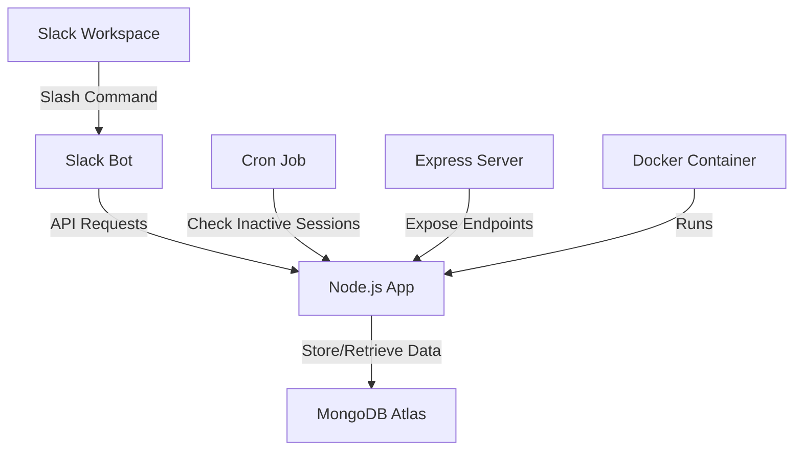

# Deep Work Tracker Slack Bot

## Table of Contents
1. [Introduction](#introduction)
2. [System Overview](#system-overview)
3. [Features](#features)
4. [Prerequisites](#prerequisites)
5. [Local Setup](#local-setup)
6. [Deployment](#deployment)
7. [Usage](#usage)
8. [Configuration](#configuration)
9. [Troubleshooting](#troubleshooting)
10. [Contributing](#contributing)
11. [License](#license)

## Introduction

The Deep Work Tracker is a Slack bot designed to help users track their deep work sessions. It allows users to start and end sessions using a slash command, stores session data for future analysis, and automatically closes inactive sessions.

## System Overview



The Deep Work Tracker system consists of the following components:
- Slack Bot: Interfaces with the Slack workspace to receive commands and send messages.
- Node.js App: Processes commands, manages sessions, and interacts with the database.
- MongoDB Atlas: Cloud-hosted database for storing session information.
- Cron Job: Regularly checks for and closes inactive sessions.
- Express Server: Provides endpoints for exporting session data and manual timeout checks.
- Docker: Containerizes the application for easy deployment and scalability.

## Features

- Start and end deep work sessions using the `/deepwork` Slack command
- Automatic timeout for inactive sessions
- Session data storage in MongoDB Atlas
- Export all session data via a REST endpoint
- Docker containerization for easy deployment
- Configurable timeout and check intervals

## Prerequisites

- Node.js (v14 or later)
- Docker and Docker Compose
- A Slack workspace with permission to add apps
- An AWS account (for EC2 deployment)
- MongoDB Atlas account (for cloud database)

## Local Setup

1. **Clone the repository:**
   ```
   git clone https://github.com/your-username/deep-work-slack-bot.git
   cd deep-work-slack-bot
   ```

2. **Create a `.env` file in the project root:**
   ```
   SLACK_SIGNING_SECRET=your_slack_signing_secret
   SLACK_BOT_TOKEN=your_slack_bot_token
   MONGODB_URI=your_mongodb_atlas_connection_string
   DEEPWORK_TIMEOUT_MINUTES=180
   CHECK_INTERVAL_MINUTES=15
   ```

3. **Build and run the Docker containers:**
   ```
   docker-compose up --build
   ```

4. **Create a Slack App:**
   - Go to https://api.slack.com/apps and create a new app
   - Under "Basic Information", note your Signing Secret
   - Under "OAuth & Permissions", add the `commands` scope and install the app to your workspace
   - Note the Bot User OAuth Token

5. **Set up slash command:**
   - In your Slack App settings, go to "Slash Commands"
   - Create a new command called `/deepwork`
   - Set the Request URL to `http://your-domain-or-ip/slack/events`

6. **Set up event subscriptions:**
   - In your Slack App settings, go to "Event Subscriptions"
   - Enable events and set the Request URL to `http://your-domain-or-ip/slack/events`
   - Subscribe to the `app_mention` bot event

## Deployment

[Deployment instructions remain largely the same as in the original README. Update the EC2 instance setup if needed.]

## Usage

- In any Slack channel, use `/deepwork [description]` to start a deep work session
- Use `/deepwork [reflection]` to end the session
- Sessions automatically close after the configured timeout period (default: 180 minutes)
- Access `http://your-domain-or-ip/export-sessions` to export all session data
- Use `http://your-domain-or-ip/check-timeouts` to manually trigger a timeout check

## Configuration

The following environment variables can be configured:

- `DEEPWORK_TIMEOUT_MINUTES`: Duration in minutes after which an inactive session is closed (default: 180)
- `CHECK_INTERVAL_MINUTES`: Interval in minutes between automatic checks for inactive sessions (default: 15)

## Troubleshooting

- **MongoDB connection issues:** Check your MongoDB Atlas connection string and ensure it's correctly set in the `.env` file
- **Slack commands not working:** Verify Slack App configuration and environment variables
- **Timeout not working:** Check `DEEPWORK_TIMEOUT_MINUTES` and `CHECK_INTERVAL_MINUTES` settings

To view logs:
```
docker logs deep-work-slack-bot-app-1
```

## Contributing

1. Fork the repository
2. Create your feature branch (`git checkout -b feature/AmazingFeature`)
3. Commit your changes (`git commit -m 'Add some AmazingFeature'`)
4. Push to the branch (`git push origin feature/AmazingFeature`)
5. Open a Pull Request

## License

This project is licensed under the MIT License - see the [LICENSE.md](LICENSE.md) file for details.